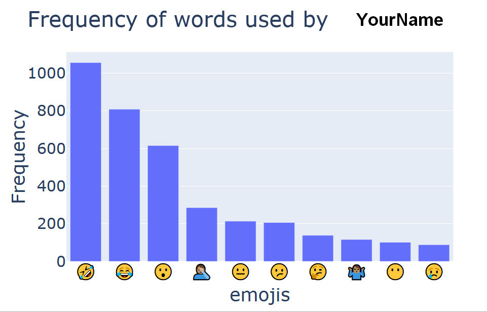

# EmojiExtractor

## Usage instructions:

* ~~Use this [Binder link](https://mybinder.org/v2/gh/light-weaver/EmojiExtractor/master)~~ Nevermind Binder doesn't work

OR 

* Download the code
* Download and install [poetry](https://github.com/sdispater/poetry)
* Make a virtual environment and run `poetry install`
* Make sure that the ipython kernel is installed:
   
   `ipython kernel install --user --name=emojiextractor`
* Download your whatsapp chat as txt
* Run `Emoji extractor.ipynb`

## Sample image

